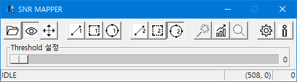
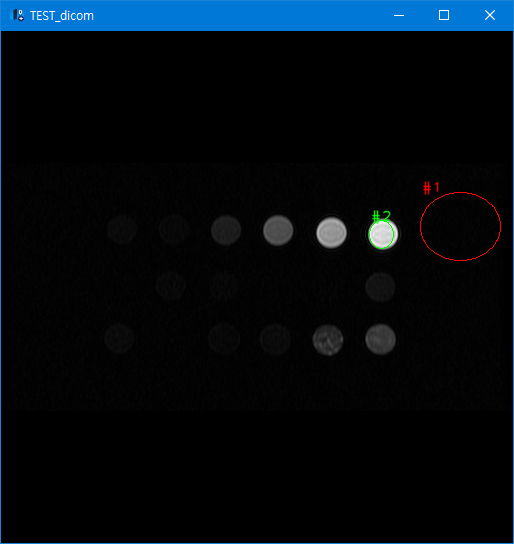
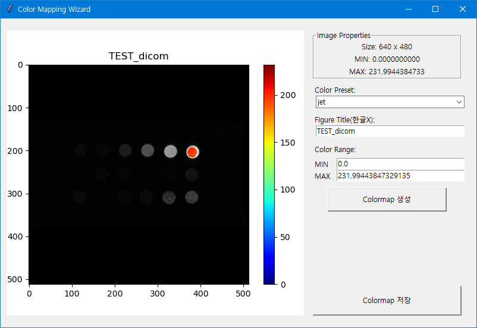

# SNR_Mapper

## Introduction
SNR Mapper is the software for generating SNR maps.

## Features
 - SNR color Mapping
 - Calculates SNR value of the ROI

## Requirements
 - Python3
 - Numpy, Scipy
 - OpenCV, PIL
 - Pydicom
 - matplotlib

## Installation
    $ git clone https://github.com/kim01414/SNR_Mapper

## How to Use
When you downloaded files and installed all requiremnts, then running:
    
    $ python SNR.py

The following formula is SNR calculation method of our software used.
    

After selecting ROI of image and background, click ROI measurment or color mapping.

## Screenshot

## Contacts
techman011@gmail.com

[BMRLab](http://bmr.knu.ac.kr/)
